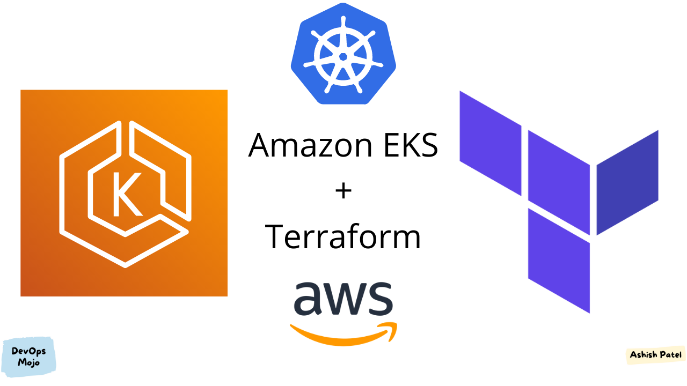

# ☁️ AWS EKS Provisioning with Terraform – Production-Ready Infrastructure as Code



---

## 📌 Sobre o Projeto

Este projeto implementa o provisionamento completo de um cluster Kubernetes na AWS utilizando Terraform como ferramenta de Infrastructure as Code (IaC).

A infraestrutura é criada seguindo boas práticas de arquitetura cloud, incluindo:

- VPC customizada
- Subnets públicas e privadas
- NAT Gateway
- Internet Gateway
- Security Groups restritivos
- Cluster Amazon EKS
- Node Groups gerenciados
- IAM Roles com princípio de menor privilégio

O objetivo é simular um ambiente Kubernetes pronto para produção com foco em segurança, escalabilidade e organização modular de código.

---

# 🏗️ Arquitetura da Solução

## 🌐 Camada de Rede (Networking)

- VPC dedicada
- 2–3 Availability Zones
- Subnets públicas (Load Balancer)
- Subnets privadas (Worker Nodes)
- NAT Gateway para saída controlada
- Internet Gateway
- Route Tables segregadas

Arquitetura baseada no modelo recomendado pela AWS para EKS.

---

## ☸️ Camada Kubernetes

- Amazon EKS
- Managed Node Group
- Auto Scaling habilitado
- Endpoint público e privado configurável
- IAM OIDC Provider para integração futura com IRSA

---

## 🔐 Segurança Aplicada

- Security Groups mínimos necessários
- IAM Roles separadas para:
  - EKS Control Plane
  - Node Group
- Princípio de menor privilégio
- Nodes em subnets privadas
- Comunicação controlada via SG

---

# ⚙️ Stack Tecnológica

- **Terraform**
- **AWS**
  - Amazon EKS
  - VPC
  - IAM
  - EC2
  - Auto Scaling
- Kubernetes
- AWS CLI
- kubectl

---

# 📁 Estrutura do Projeto

```
terraform-aws-eks/
│
├── main.tf
├── variables.tf
├── outputs.tf
├── providers.tf
├── versions.tf
│
├── modules/
│   ├── vpc/
│   ├── eks/
│   └── security/
│
└── environments/
    ├── dev/
    └── prod/
```

Estrutura modular para permitir reutilização e escalabilidade.

---

# 🚀 Provisionamento

## 1️⃣ Inicializar Terraform

```
terraform init
```

## 2️⃣ Validar plano

```
terraform plan
```

## 3️⃣ Aplicar infraestrutura

```
terraform apply
```

Terraform cria automaticamente:

✔ VPC  
✔ Subnets públicas e privadas  
✔ NAT Gateway  
✔ Internet Gateway  
✔ Route Tables  
✔ Security Groups  
✔ IAM Roles  
✔ Cluster EKS  
✔ Node Group  

---

# 📊 Validação do Cluster

Após provisionamento:

```
aws eks update-kubeconfig --region <region> --name <cluster-name>
kubectl get nodes
```

Cluster pronto para deploy de workloads.

---

# 📈 Escalabilidade

- Node Group com Auto Scaling configurado
- Definição de min, max e desired capacity
- Possibilidade de adicionar novos Node Groups
- Preparado para integração futura com Cluster Autoscaler

---

# 🧠 Decisões Técnicas

- Uso de Terraform para versionamento da infraestrutura
- Estrutura modular para facilitar manutenção
- Subnets privadas para workloads
- NAT Gateway para saída segura
- Uso de Managed Node Groups para simplificar operação
- Preparação para IRSA (IAM Roles for Service Accounts)

---

# 🔄 Possíveis Extensões

- Deploy automatizado via GitHub Actions
- Integração com ArgoCD
- Implementação de Ingress Controller
- Adição de ALB Controller
- Monitoramento com Prometheus + Grafana
- Implementação de OpenTelemetry

---

# 📚 Aprendizados Aplicados

- Provisionamento completo de cluster EKS
- Arquitetura AWS baseada em boas práticas
- Infraestrutura modular com Terraform
- Segurança em ambientes Kubernetes
- Organização por ambientes (dev/prod)

---

# 📈 Resultados Técnicos

✔ Cluster EKS provisionado via IaC  
✔ Infraestrutura reproduzível  
✔ Arquitetura escalável  
✔ Segurança aplicada  
✔ Estrutura pronta para ambiente corporativo  

---

# 🎯 Foco do Projeto

Cloud Engineer  
DevOps Engineer  
Platform Engineer  
Kubernetes Engineer  

---

> Este projeto demonstra a criação de infraestrutura Kubernetes na AWS utilizando Terraform, aplicando boas práticas de arquitetura, segurança e modularização de código.
